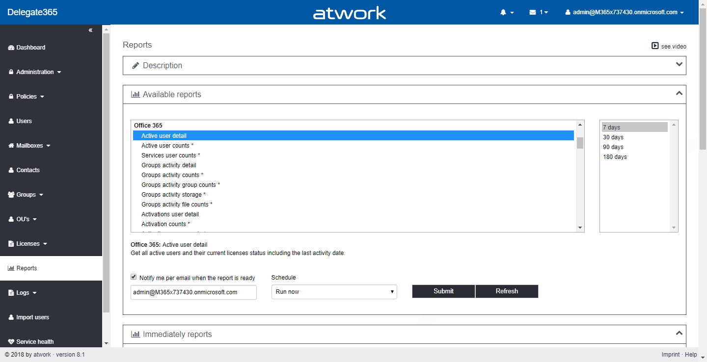
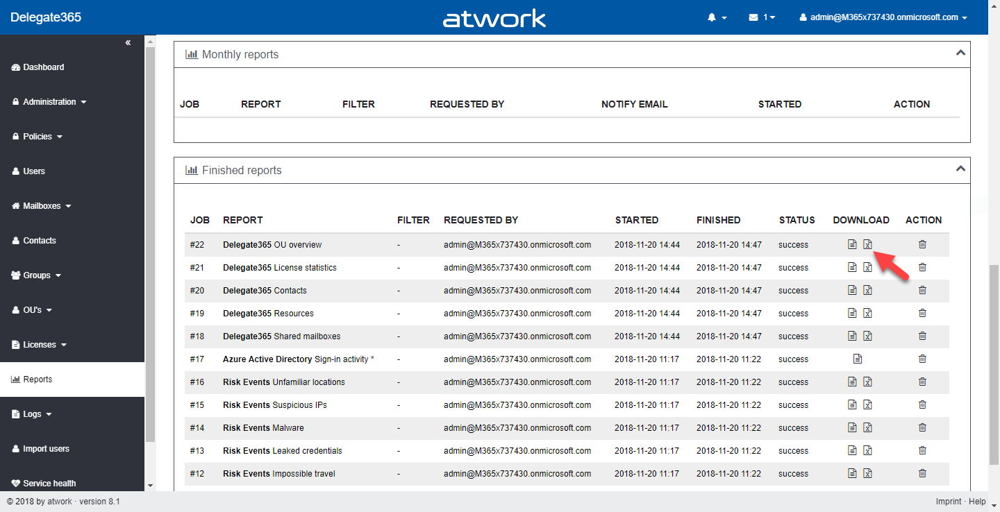

# Reports
Delegate365 allows to run instant reports and time triggered reports. All Admins with permission to the reports module can run the reports. By default, the reports are filtered just for the entitled OU's of the admin. If a user has report administration permission, there are more reports available and there is no OU filter applied, so data is reported tenant-wide.

## Run a report
The "Available reports" box shows the list of reports that can be run from Delegate365. The reports are grouped by category: Azure Active Directory, Risk Events, Office 365,Microsoft Teams, Skype for Business, Yammer, SharePoint, OneDrive, Exchange and Delegate365. Select the desired report. Below the list, a short description is shown. The date filter becomes active if a date filter can be applied. By default, all reports are filterd just for the entitled data. Only report administrators see data from the whole Office 365 tenant.

Optionally, you can be notified when the report has been generated. The Schedule dropdown allows to run an instant report, or generate a recurring report. There, weekly (each Monday) or monthly (each 1st) can be chosen. Once you submit the report, the report generation job will show up in the corresponding box below. The report engine checks the reports in the queue and generates the output. Once the generation is completed, the user will get an email with a link to this page, and the report will show up in the "Finished reports" box at the page end. Alternatively, a user can click the "Refresh" button to check if the report was already generated.

The reports are generated as CSV file and as Excel file. The filename is the job number plus the file type. There are just some exceptions for reports that can be very large, where only a CSV file is generated. Click on the CSV icon or on the Excel icon to download the generated report for further processing.

The report generation can take some minutes, depending on the size of data. The generated reort files are available for 7 days are are automatically deleted after that time. There is no file backup, so pls. download the files if needed within one week. You find a list of all available reports with sample report files at [Reports List](./2-Reports-List.md).

[Back]() - [Next](./2-Reports-List.md)
