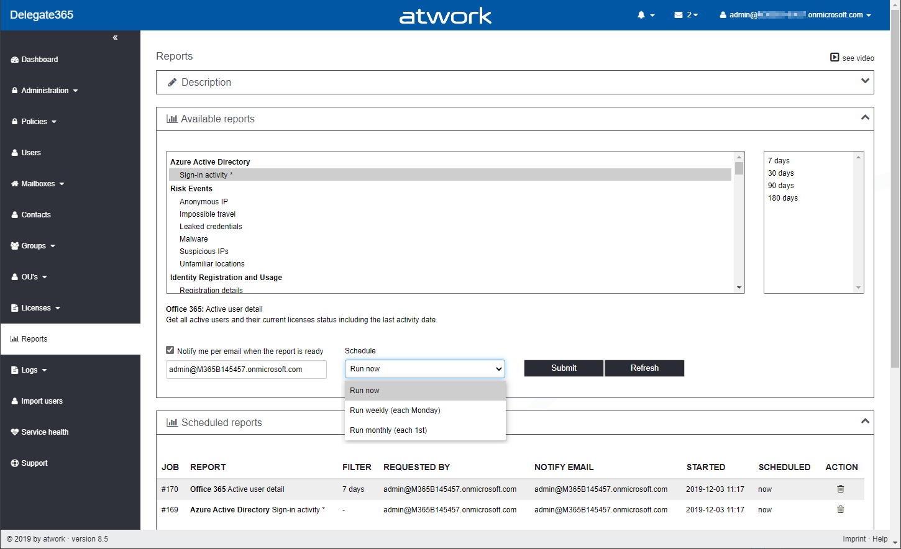
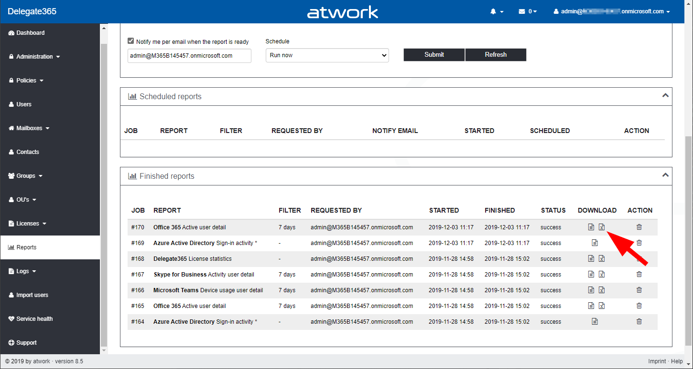
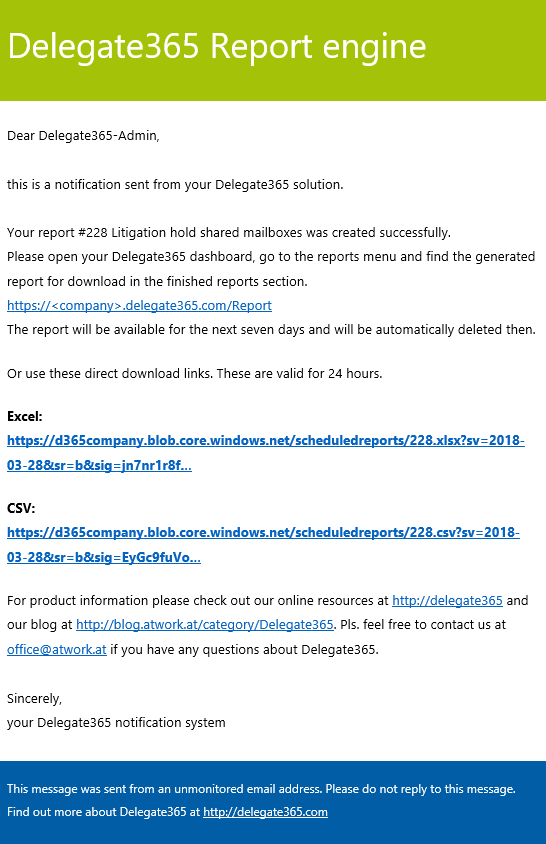
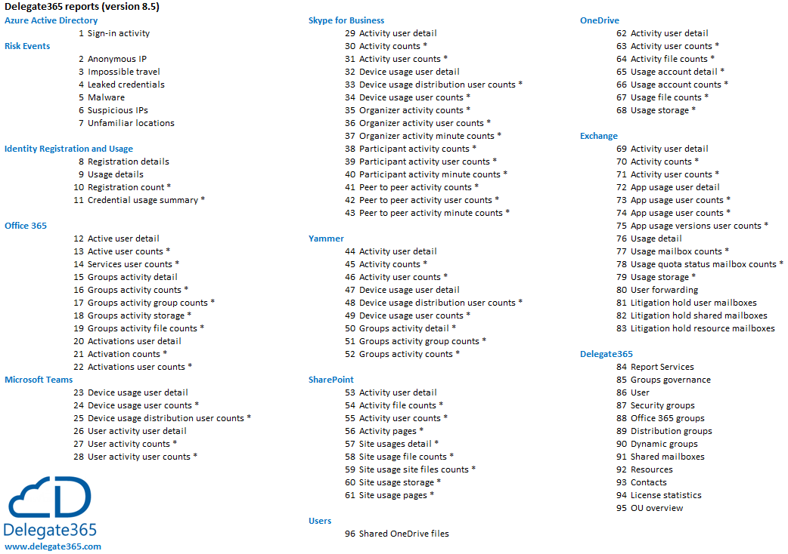

# Delegate365 Manual for Reports
Delegate365 is an Add-On for customers using Microsoft Office 365 and allows delegation, self-management, license-management and auditing. The software is provided as Software-as-a-Service solution in the Microsoft Cloud on Microsoft Azure and can be used instantly, see [Delegate365](https://www.Delegate365.com).

## Reports
Delegate365 allows to run instant reports and time triggered reports. All Admins with permission to the reports module can run the reports. **By default, the reports are filtered just for the entitled OU's of the admin.** If a user has report administration permission, there are more reports available and there is no OU filter applied, so data is reported tenant-wide.

## Run a report
The "Available reports" box shows the list of reports that can be run from Delegate365. The reports are grouped by category: Azure Active Directory, Risk Events, Office 365,Microsoft Teams, Skype for Business, Yammer, SharePoint, OneDrive, Exchange and Delegate365. Select the desired report. Below the list, a short description is shown. The date filter becomes active if a date filter can be applied. By default, all reports are filterd just for the entitled data. Only report administrators see data from the whole Office 365 tenant.

Optionally, you can be notified when the report has been generated. The Schedule dropdown allows to run an instant report, or generate a recurring report. There, weekly (each Monday) or monthly (each 1st) can be chosen. Once you submit the report, the report generation job will show up in the corresponding box below. The report engine checks the reports in the queue and generates the output. Once the generation is completed, the user will get an email with a link to this page, and the report will show up in the "Finished reports" box at the page end. Alternatively, a user can click the "Refresh" button to check if the report was already generated.

The reports are generated as CSV file and as Excel file. The filename is the job number plus the file type. There are just some exceptions for reports that can be very large, where only a CSV file is generated. Click on the CSV icon or on the Excel icon to download the generated report for further processing.

The report generation can take some minutes, depending on the size of data. The generated reort files are available for 7 days are are automatically deleted after that time. If the configuration is set to send a direct download link, this link is valid for 24 hours. Users can directly open the generated report then as shown in thie sample here.

There is no file backup, so pls. download the files if needed within one week. You find a list of all available reports with sample report files here.

## Report Overview

The following graphics shows an overview of the available reports in the current version of Delegate365.

## Report List

This list includes an enumeration of currently available reports in Delegate365. Reports that are marked with Admin-Only are only available for users who have the *report administration permission* assigned. Click on the sample link to see a sample output in CSV or Excel format with some records to understand the fields that are included. 

| Category               | Report                    | Admin-Only | Sample                                  |  Description      |
|:-----------------------|:--------------------------|:----------:|:---------------------------------------:|:------------------|
| Azure Active Directory | Sign-in activity          | yes        | [CSV](./Samples/AAD-SignIn-Activity.csv) [XLSX](./Samples/AAD-SignIn-Activity.xlsx)| Information about the usage of managed applications and user sign-in activities. To access this report through the reporting API, you must have an Azure Active Directory Premium P1 or P2 edition.
| Risk Events            | Anonymous IP              | -          | [CSV](./Samples/Risk-Events-Anonymous-IP.csv) [XLSX](./Samples/Risk-Events-Anonymous-IP.xlsx) | Show successful logins from anonymous proxy IP addresses that could be used to hide a device’s IP address, and may be used for malicious intent.
| Risk Events            | Impossible travel         | -          | [CSV](./Samples/Risk-Events-Impossible-travel.csv) [XLSX](./Samples/Risk-Events-Impossible-travel.xlsx) | Get sign-ins from geographically distant locations, that are also atypical for the user (after an initial learning period of 14 days).
| Risk Events            | Leaked credentials        | -          | [CSV](./Samples/Risk-Events-Leaked-credentials.csv) [XLSX](./Samples/Risk-Events-Leaked-credentials.xlsx) | Get stolen credentials. Microsoft leaked credentials service checks stolen username and password pairs by monitoring public and dark web sites.
| Risk Events            | Malware                   | -          | [CSV](./Samples/Risk-Events-Malware.csv) [XLSX](./Samples/Risk-Events-Malware.xlsx) | Get sign-ins from devices infected with malware that are known to actively communicate with a malicious bot by correlating IP addresses.
| Risk Events            | Suspicious IPs            | -          | [CSV](./Samples/Risk-Events-Suspicious-IPs.csv) [XLSX](./Samples/Risk-Events-Suspicious-IPs.xlsx) | Get IP addresses from which a high number of failed sign-in attempts were seen over a short period of time.
| Risk Events            | Unfamiliar locations      | -          | [CSV](./Samples/Risk-Events-Unfamiliar-locations.csv) [XLSX](./Samples/Risk-Events-Unfamiliar-locations.xlsx) | User logins from unfamiliar locations not close to known and familiar locations (after an initial learning period of 30 days).
| Identity Registration and Usage | Registration details     | -          | [CSV](./Samples/Identity-Registration-details.csv) [XLSX](./Samples/Identity-Registration-details.xlsx) | Get a list of credential user registration details objects for the tenant.
| Identity Registration and Usage | Usage details            | -          | [CSV](./Samples/Identity-Usage-details.csv) [XLSX](./Samples/Identity-Usage-details.xlsx) | Get a list of user credential usage details objects for a given tenant. Details include user information, status of the reset, and the reason for failure.
| Identity Registration and Usage | Registration count       | yes        | [CSV](./Samples/Identity-Registration-count.csv) [XLSX](./Samples/Identity-Registration-count.xlsx) | Report the current state of how many users in your organization are registered for self-service password reset and multi-factor authentication (MFA) capabilities.
| Identity Registration and Usage | Credential usage summary | yes        | [CSV](./Samples/Identity-Credential-usage-summary.csv) [XLSX](./Samples/Identity-Credential-usage-summary.xlsx) | Get a list of credential user registration details objects for a given tenant.
| Office 365             | Active user detail        | -          | [CSV](./Samples/Office365-Active-user-detail.csv) [XLSX](./Samples/Office365-Active-user-detail.xlsx) | Get all active users and their current licenses status including the last activity date.
| Office 365             | Active user counts        | yes        | [CSV](./Samples/Office365-Active-user-counts.csv) [XLSX](./Samples/Office365-Active-user-counts.xlsx) | Get the count of daily active users in the reporting period by product.
| Office 365             | Services user counts      | yes        | [CSV](./Samples/Office365-Services-user-counts.csv) [XLSX](./Samples/Office365-Services-user-counts.xlsx) | Get the count of users by activity type and Office 365 service.
| Office 365             | Groups activity detail    | -          | [CSV](./Samples/Office365-Groups-activity-detail.csv) [XLSX](./Samples/Office365-Groups-activity-detail.xlsx) | Get an Office 365 groups statistics and size of stored data per Office 365 group.
| Office 365             | Groups activity counts    | yes        | [CSV](./Samples/Office365-Groups-activity-counts.csv) [XLSX](./Samples/Office365-Groups-activity-counts.xlsx) | Get the number of group activities across Office 365 group workloads.
| Office 365             | Groups activity group counts | yes     | [CSV](./Samples/Office365-Groups-activity-group-counts.csv) [XLSX](./Samples/Office365-Groups-activity-group-counts.xlsx) | Get the daily total number of Office 365 groups and how many of them were active based on email conversations, Yammer posts, and SharePoint file activities.
| Office 365             | Groups activity storage   | yes        | [CSV](./Samples/Office365-Groups-activity-storage.csv) [XLSX](./Samples/Office365-Groups-activity-storage.xlsx) | Get the total storage used across all Office 365 group mailboxes and group sites.
| Office 365             | Groups activity file counts  | yes     | [CSV](./Samples/Office365-Groups-activity-file-counts.csv) [XLSX](./Samples/Office365-Groups-activity-file-counts.xlsx) | Groups activity file counts.
| Office 365             | Activations user detail   | -          | [CSV](./Samples/Office365-Activations-user-detail.csv) [XLSX](./Samples/Office365-Activations-user-detail.xlsx) | Get the activated Office 365 licenses by user.
| Office 365             | Activation counts         | yes        | [CSV](./Samples/Office365-Activation-counts.csv) [XLSX](./Samples/Office365-Activation-counts.xlsx) | Get the count of Office 365 activations on desktops and devices.
| Office 365             | Activations user counts   | yes        | [CSV](./Samples/Office365-Activations-user-counts.csv) [XLSX](./Samples/Office365-Activations-user-counts.xlsx) | Get the count of users that are enabled and those that have activated the Office subscription on desktops or other devices.
| Microsoft Teams        | Device usage user detail  | -          | [CSV](./Samples/Microsoft-Teams-Device-usage-user-detail.csv) [XLSX](./Samples/Microsoft-Teams-Device-usage-user-detail.xlsx) | Get the devices used for accessing Microsoft Teams by user.
| Microsoft Teams        | Device usage user counts  | yes        | [CSV](./Samples/Microsoft-Teams-Device-usage-user-counts.csv) [XLSX](./Samples/Microsoft-Teams-Device-usage-user-counts.xlsx) | Get the number of Microsoft Teams daily unique users by device type.
| Microsoft Teams        | Device usage distribution user counts  | yes         | [CSV](./Samples/Microsoft-Teams-Device-usage-distribution-user-counts.csv) [XLSX](./Samples/Microsoft-Teams-Device-usage-distribution-user-counts.xlsx) | Get the number of Microsoft Teams unique users by device type over the selected time period.
| Microsoft Teams        | User activity user detail | -          | [CSV](./Samples/Microsoft-Teams-User-activity-user-detail.csv) [XLSX](./Samples/Microsoft-Teams-User-activity-user-detail.xlsx) | Get the users and when they last accessed Microsoft Teams.
| Microsoft Teams        | User activity counts      | yes        | [CSV](./Samples/Microsoft-Teams-User-activity-counts.csv) [XLSX](./Samples/Microsoft-Teams-User-activity-counts.xlsx) | Get the number of Microsoft Teams activities by activity type. The activity types are team chat messages, private chat messages, calls, and meetings.
| Microsoft Teams        | User activity user counts | yes        | [CSV](./Samples/Microsoft-Teams-User-activity-user-counts.csv) [XLSX](./Samples/Microsoft-Teams-User-activity-user-counts.xlsx) | Get the number of Microsoft Teams users by activity type. The activity types are number of teams chat messages, private chat messages, calls or meetings.
| Skype for Business     | Activity user detail      | -          | [CSV](./Samples/Skype-Activity-user-detail.csv) [XLSX](./Samples/Skype-Activity-user-detail.xlsx) | Get the a Skype for Business statistics by user, number of conferences, minutes, participations and more.
| Skype for Business     | Activity counts           | yes        | [CSV](./Samples/Skype-Activity-counts.csv) [XLSX](./Samples/Skype-Activity-counts.xlsx) | Get the SFB trends on how many users organized and participated in conference sessions held in your organization and the number of peer-to-peer sessions through Skype for Business.
| Skype for Business     | Activity user counts      | yes        | [CSV](./Samples/Skype-Activity-user-counts.csv) [XLSX](./Samples/Skype-Activity-user-counts.xlsx) | Get the SFB trends on how many unique users organized and participated in conference sessions held in your organization and the number of peer-to-peer sessions through Skype for Business.
| Skype for Business     | Device usage user detail  | -          | [CSV](./Samples/Skype-Device-usage-user-detail.csv) [XLSX](./Samples/Skype-Device-usage-user-detail.xlsx) | Get details about Skype for Business device usage by user.
| Skype for Business     | Device usage distribution user counts  | yes         | [CSV](./Samples/Skype-Device-usage-distribution-user-counts.csv) [XLSX](./Samples/Skype-Device-usage-distribution-user-counts.xlsx) | Get the number of SFB users using unique devices in your organization. The report will show you the number of users per device including phones and iPad.
| Skype for Business     | Device usage user counts  | yes        | [CSV](./Samples/Skype-Device-usage-user-counts.csv) [XLSX](./Samples/Skype-Device-usage-user-counts.xlsx) |  Get the SFB usage trends on how many users in your organization have connected using the Skype for Business app device including phones and iPad.
| Skype for Business     | Organizer activity counts | yes        | [CSV](./Samples/Skype-Organizer-activity-counts.csv) [XLSX](./Samples/Skype-Organizer-activity-counts.xlsx) | Get SFB usage trends on the number and type of conference sessions held and organized by users in your organization including IM, audio/video, application sharing, web, dial-in/out - 3rd party, and Dial-in/out Microsoft.
| Skype for Business     | Organizer activity user counts         | yes         | [CSV](./Samples/Skype-Organizer-activity-user-counts.csv) [XLSX](./Samples/Skype-Organizer-activity-user-counts.xlsx) | Get SFB usage trends on the number of unique users and type of conference sessions held and organized by users in your organization including IM, audio/video, application sharing, web, dial-in/out - 3rd party, and dial-in/out Microsoft.
| Skype for Business     | Organizer activity minute counts       | yes         | [CSV](./Samples/Skype-Organizer-activity-minute-counts.csv) [XLSX](./Samples/Skype-Organizer-activity-minute-counts.xlsx) | Get usage trends on the number of unique users and type of conference sessions held and organized by users in your organization including IM, audio/video, application sharing, web, dial-in/out - 3rd party, and dial-in/out Microsoft.
| Skype for Business     | Participant activity counts            | yes         | [CSV](./Samples/Skype-Participant-activity-counts.csv) [XLSX](./Samples/Skype-Participant-activity-counts.xlsx) | Get SFB usage trends on the number and type of conference sessions that users from your organization participated in including IM, audio/video, application sharing, web, and dial-in/out - 3rd party.
| Skype for Business     | Participant activity user counts       | yes         | [CSV](./Samples/Skype-Participant-activity-user-counts.csv) [XLSX](./Samples/Skype-Participant-activity-user-counts.xlsx) | Get SFB usage trends on the number of unique users and type of conference sessions that users from your organization participated in including IM, audio/video, application sharing, web, and dial-in/out - 3rd party.
| Skype for Business     | Participant activity minute counts     | yes         | [CSV](./Samples/Skype-Participant-activity-minute-counts.csv) [XLSX](./Samples/Skype-Participant-activity-minute-counts.xlsx) | Get SFB usage trends on the length in minutes and type of conference sessions that users from your organization participated in including audio/video.
| Skype for Business     | Peer to peer activity counts           | yes         | [CSV](./Samples/Skype-Peer-to-peer-activity-counts.csv) [XLSX](./Samples/Skype-Peer-to-peer-activity-counts.xlsx) | Get SFB peer-to-peer usage trends on the number and type of sessions held in your organization including IM, audio, video, application sharing, and file transfer.
| Skype for Business     | Peer to peer activity user counts      | yes         | [CSV](./Samples/Skype-Peer-to-peer-activity-user-counts.csv) [XLSX](./Samples/Skype-Peer-to-peer-activity-user-counts.xlsx) | Get SFB peer-to-peer usage trends on the number of unique users and type of peer-to-peer sessions held in your organization including IM, audio, video, application sharing, and file transfers.
| Skype for Business     | Peer to peer activity minute counts    | yes         | [CSV](./Samples/Skype-Peer-to-peer-activity-minute-counts.csv)  [CSV](./Samples/Skype-Peer-to-peer-activity-minute-counts.xlsx) | Get SFB peer-to-peer usage trends on the number of unique users and type of peer-to-peer sessions held in your organization including IM, audio, video, application sharing, and file transfers.
| Yammer       | Activity user detail                         | -          | [CSV](./Samples/Yammer-Activity-user-detail.csv) [XLSX](./Samples/Yammer-Activity-user-detail.xlsx) | Get the last Yammer activity date by user, number of posts written, read and liked.
| Yammer       | Activity counts                              | yes        | [CSV](./Samples/Yammer-Activity-counts.csv) [XLSX](./Samples/Yammer-Activity-counts.xlsx)| Get the trends on the amount of Yammer activity in your organization by how many messages were posted, read, and liked.
| Yammer       | Activity user counts                         | yes        | [CSV](./Samples/Yammer-Activity-user-counts.csv) [XLSX](./Samples/Yammer-Activity-user-counts.xlsx)| Get the trends on the number of unique users who posted, read, and liked Yammer messages.
| Yammer       | Device usage user detail                     | -          | [CSV](./Samples/Yammer-Device-usage-user-detail.csv) [XLSX](./Samples/Yammer-Device-usage-user-detail.xlsx)| Get device usage user details.
| Yammer       | Device usage distribution user counts        | yes        | [CSV](./Samples/Yammer-Device-usage-distribution-user-counts.csv) [XLSX](./Samples/Yammer-Device-usage-distribution-user-counts.xlsx) | Get the number of Yammer users by device type.
| Yammer       | Device usage user counts                     | yes        | [CSV](./Samples/Yammer-Device-usage-user-counts.csv) [XLSX](./Samples/Yammer-Device-usage-user-counts.xlsx)| Get the number of daily Yammer users by device type.
| Yammer       | Groups activity detail                       | yes        | [CSV](./Samples/Yammer-Groups-activity-detail.csv) [XLSX](./Samples/Yammer-Groups-activity-detail.xlsx) | Get details about Yammer groups activity by group.
| Yammer       | Groups activity group counts                 | yes        | [CSV](./Samples/Yammer-Groups-activity-group-counts.csv) [XLSX](./Samples/Yammer-Groups-activity-group-counts.xlsx) | Get the total number of Yammer groups that existed and how many included group conversation activity.
| Yammer       | Groups activity counts                       | yes        | [CSV](./Samples/Yammer-Groups-activity-counts.csv) [XLSX](./Samples/Yammer-Groups-activity-counts.xlsx) | Get the number of Yammer messages posted, read, and liked in groups.
| SharePoint   | Activity user detail                         | -          | [CSV](./Samples/SharePoint-Activity-user-detail.csv) [XLSX](./Samples/SharePoint-Activity-user-detail.xlsx) | Activity user detail of SharePoint Online.
| SharePoint   | Activity file counts                         | yes         | [CSV](./Samples/SharePoint-Activity-file-counts.csv) [XLSX](./Samples/SharePoint-Activity-file-counts.xlsx) | Get the number of unique and licensed users who interacted with files stored in SharePoint sites.
| SharePoint   | Activity user counts                         | yes         | [CSV](./Samples/SharePoint-Activity-user-counts.csv) [XLSX](./Samples/SharePoint-Activity-user-counts.xlsx) | Get the trend in the number of active SharePoint users. Active users are counted by a file activity or a page visit within the specified time period.
| SharePoint   | Activity pages                               | yes         | [CSV](./Samples/SharePoint-Activity-pages.csv) [XLSX](./Samples/SharePoint-Activity-pages.xlsx) |  Get the number of unique SharePoint pages visited by users.
| SharePoint   | Site usages detail                           | yes         | [CSV](./Samples/SharePoint-Site-usages-detail.csv) [XLSX](./Samples/SharePoint-Site-usages-detail.xlsx) | Get details about the SharePoint sites usage.
| SharePoint   | Site usage file counts                       | yes         | [CSV](./Samples/SharePoint-Site-usage-file-counts.csv) [XLSX](./Samples/SharePoint-Site-usage-file-counts.xlsx) | Get the total number of SharePoint files across all sites and the number of active files within the specified time period.
| SharePoint   | Site usage site files counts                 | yes         | [CSV](./Samples/SharePoint-Site-usage-site-files-counts.csv) [XLSX](./Samples/SharePoint-Site-usage-site-files-counts.xlsx) | Get the total number of SharePoint sites usage across all sites within the specified time period.
| SharePoint   | Site usage storage                           | yes         | [CSV](./Samples/SharePoint-Site-usage-storage.csv) [XLSX](./Samples/SharePoint-Site-usage-storage.xlsx) | Get the trend of SharePoint storage allocated and consumed during the reporting period.
| SharePoint   | Site usage pages                             | yes         | [CSV](./Samples/SharePoint-Site-usage-pages.csv) [XLSX](./Samples/SharePoint-Site-usage-pages.xlsx) | Get the number of SharePoint pages viewed across all sites.
| OneDrive     | Activity user detail                         | -           | [CSV](./Samples/OneDrive-Activity-user-detail.csv) [XLSX](./Samples/OneDrive-Activity-user-detail.xlsx) | Get the last OneDrive activity date by user and the number of files accessed and shared.
| OneDrive     | Activity user counts                         | yes         | [CSV](./Samples/OneDrive-Activity-user-counts.csv) [XLSX](./Samples/OneDrive-Activity-user-counts.xlsx) | Get the trend in the number of active OneDrive users.
| OneDrive     | Activity file counts                         | yes         | [CSV](./Samples/OneDrive-Activity-file-counts.csv) [XLSX](./Samples/OneDrive-Activity-file-counts.xlsx) | Get the number of unique and licensed users that performed file interactions against any OneDrive account.
| OneDrive     | Usage account detail                         | yes         | [CSV](./Samples/OneDrive-Usage-account-detail.csv) [XLSX](./Samples/OneDrive-Usage-account-detail.xlsx) | Get details about OneDrive usage by account.
| OneDrive     | Usage account counts                         | yes         | [CSV](./Samples/OneDrive-Usage-account-counts.csv) [XLSX](./Samples/OneDrive-Usage-account-counts.xlsx) | Get the trend of active OneDrive for Business sites including the number of viewed, modified, uploaded, downloaded, shared, or synced files.
| OneDrive     | Usage file counts                            | yes         | [CSV](./Samples/OneDrive-Usage-file-counts.csv) [XLSX](./Samples/OneDrive-Usage-file-counts.xlsx) | Get the total number of OneDrive files across all sites and how many are active files in the given time period. 
| OneDrive     | Usage storage                                | yes         | [CSV](./Samples/OneDrive-Usage-storage.csv) [XLSX](./Samples/OneDrive-Usage-storage.xlsx) | Get the trend on the amount of storage that is being used in OneDrive for Business.
| Exchange     | Activity user detail                         | -           | [CSV](./Samples/Exchange-Activity-user-detail.csv) [XLSX](./Samples/Exchange-Activity-user-detail.xlsx) | Get the last email activity date per user, emails sent, received and read.
| Exchange     | Activity counts                              | yes         | [CSV](./Samples/Exchange-Activity-counts.csv) [XLSX](./Samples/Exchange-Activity-counts.xlsx) |  Understand the trends of email activity and see how many emails were sent, read, and received in your organization.
| Exchange     | Activity user counts                         | yes         | [CSV](./Samples/Exchange-Activity-user-counts.csv) [XLSX](./Samples/Exchange-Activity-user-counts.xlsx) | Understand trends on the number of unique email users who are performing activities like email send, read, and receive.
| Exchange     | App usage user detail                        | -           | [CSV](./Samples/Exchange-App-usage-user-detail.csv) [XLSX](./Samples/Exchange-App-usage-user-detail.xlsx) | See which apps and protocols users are using for accessing their mailbox.
| Exchange     | App usage apps user counts                   | yes         | [CSV](./Samples/Exchange-App-usage-apps-user-counts.csv) [XLSX](./Samples/Exchange-App-usage-apps-user-counts.xlsx) | Get the count of unique users by email app.
| Exchange     | App usage user counts                        | yes         | [CSV](./Samples/Exchange-App-usage-user-counts.csv) [XLSX](./Samples/Exchange-App-usage-user-counts.xlsx) | Get the count of unique users that connected to Exchange Online using any email app.
| Exchange     | App usage versions user counts               | yes         | [CSV](./Samples/Exchange-App-usage-versions-user-counts.csv) [XLSX](./Samples/Exchange-App-usage-versions-user-counts.xlsx) | Get the count of unique users by Outlook desktop version.
| Exchange     | Usage detail                                 | -           | [CSV](./Samples/Exchange-Usage-detail.csv) [XLSX](./Samples/Exchange-Usage-detail.cxlsxsv) | Get detailed information about mailbox usage as the mailbox size, the number of items, quotas and more.
| Exchange     | Usage mailbox counts                         | yes         | [CSV](./Samples/Exchange-Usage-mailbox-counts.csv) [XLSX](./Samples/Exchange-Usage-mailbox-counts.xlsx) | Get the total number of user mailboxes in your organization and how many are active each day during the given time period.
| Exchange     | Usage quota status mailbox counts            | yes         | [CSV](./Samples/Exchange-Usage-quota-status-mailbox-counts.csv) [XLSX](./Samples/Exchange-Usage-quota-status-mailbox-counts.xlsx) | Get the count of user mailboxes by each quota category.
| Exchange     | Usage storage                                | yes         | [CSV](./Samples/Exchange-Usage-storage.csv) [XLSX](./Samples/Exchange-Usage-storage.xlsx) | Get the amount of storage used by mailboxes in your organization.
| Exchange     | User forwarding                              | -           | [CSV](./Samples/Exchange-User-forwarding.csv) [XLSX](./Samples/Exchange-User-forwarding.xlsx) |  Get a list of all users within your OU's with information if email forwarding is activated.
| Exchange     | Litigation hold user mailboxes               | -           | [CSV](./Samples/Exchange-Litigation-hold-user-mailboxes.csv) [XLSX](./Samples/Exchange-Litigation-hold-user-mailboxes.xlsx) | Get the litigation hold information of your user mailboxes.
| Exchange     | Litigation hold shared mailboxes             | -           | [CSV](./Samples/Exchange-Litigation-hold-shared-mailboxes.csv) [XLSX](./Samples/Exchange-Litigation-hold-shared-mailboxes.xlsx) | Get the litigation hold information of your shared mailboxes.
| Exchange     | Litigation hold resource mailboxes           | -           | [CSV](./Samples/Exchange-Litigation-hold-resource-mailboxes.csv) [XLSX](./Samples/Exchange-Litigation-hold-resource-mailboxes.xlsx) | Get the litigation hold information of your resource mailboxes.
| Delegate365  | Report Services                              | -           | [CSV](./Samples/Delegate365-Report-Services.csv) [XLSX](./Samples/Delegate365-Report-Services.xlsx) | Report the count of active users in the services, such as Exchange, OneDrive, SharePoint, Teams, Skype and Yammer
| Delegate365  | Groups governance                            | yes         | [CSV](./Samples/Delegate365-Groups-governance.csv) [XLSX](./Samples/Delegate365-Groups-governance.xlsx) | All Office 365 groups at a glance with visibility, classification, renewed date, type, owner count, members and guests.
| Delegate365  | User                                         | -           | [CSV](./Samples/Delegate365-User.csv) [XLSX](./Samples/Delegate365-User.xlsx) | A list of all users the admin can manage.
| Delegate365  | Security groups                              | -           | [CSV](./Samples/Delegate365-Security-groups.csv) [XLSX](./Samples/Delegate365-Security-groups.xlsx) | A list of all security groups the admin can manage.
| Delegate365  | Office 365 groups                            | -           | [CSV](./Samples/Delegate365-Office365-groups.csv) [XLSX](./Samples/Delegate365-Office365-groups.xlsx) | A list of all Office 365 groups the admin can manage.
| Delegate365  | Distribution groups                          | -           | [CSV](./Samples/Delegate365-Distribution-groups.csv) [XLSX](./Samples/Delegate365-Distribution-groups.xlsx) | A list of all distribution groups the admin can manage.
| Delegate365  | Dynamic groups                               | -           | [CSV](./Samples/Delegate365-Dynamic-groups.csv) [XLSX](./Samples/Delegate365-Dynamic-groups.xlsx) | A list of all dynamic groups the admin can manage. 
| Delegate365  | Shared mailboxes                             | -           | [CSV](./Samples/Delegate365-Shared-mailboxes.csv) [XLSX](./Samples/Delegate365-Shared-mailboxes.xlsx) | A list of all shared mailboxes the admin can manage. 
| Delegate365  | Resources                                    | -           | [CSV](./Samples/Delegate365-Resources.csv) [XLSX](./Samples/Delegate365-Resources.xlsx) | A list of all resource mailboxes the admin can manage. 
| Delegate365  | Contacts                                     | -           | [CSV](./Samples/Delegate365-Contacts.csv) [XLSX](./Samples/Delegate365-Contacts.xlsx) | A list of all contacts the admin can manage. 
| Delegate365  | License-statistics                           | -           | [CSV](./Samples/Delegate365-License-statistics.csv) [XLSX](./Samples/Delegate365-License-statistics.xlsx) | Shows a list of used Office 365 licenses and license quotas for each OU and license.
| Delegate365  | OU overview                                  | -           | [CSV](./Samples/Delegate365-OU-overview.csv) [XLSX](./Samples/Delegate365-OU-overview.xlsx) | A list of objects that are assigned to an OU the admin can manage. 

***Note:*** To download the Delegate365 report list as Excel file, click [here](./Samples/Delegate365-Reports-List.xlsx). If you want to get all sample reports in CSV or Excel format, you can download a [ZIP file](./Samples/Delegate365-Reports-Samples.zip) containing all files for further usage.

## Remarks

report-notification

## Remarks

This is a consolidated version of the rpevious versions in this repository for a quick overview of reports that are available in Delegate365. This list will change with newer versions and will b eupdated continuously.
All information in this reporistory, including Internet or other external references, is subject to change without notice. No part of this document may be reproduced or stored in a retrieval system or transmitted in any form or by any means without the express written permission of atwork gmbh (called "[atwork](https://www.atwork-it.com)" herein). Any names of actual companies and products mentioned herein may be the trademarks of their respective owners.

## More information

For information about atwork pls. contact [**atwork**](https://www.atwork-it.com).

For information about Delegate365 pls. visit [**Delegate365**](https://www.Delegate365.com).

(c) by [atwork](https://www.atwork-it.com)
